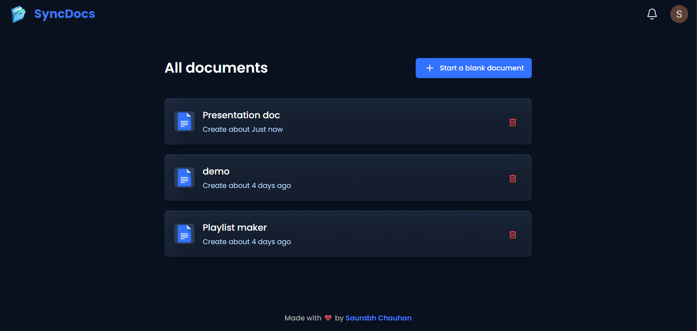

# <div align="center">SyncDocs 📝

<div><div align="center">
**SyncDocs** is a modern, real-time collaborative document editor built with Next.js. Create, edit, and collaborate on documents seamlessly with live updates, comments, and rich text formatting.

---

[](https://nextjs.org/)
[](https://reactjs.org/)
[](https://www.typescriptlang.org/)
[](https://tailwindcss.com/)
[](https://liveblocks.io/)
[](https://clerk.com/)
 </div>

---

## <div align="center"> [Demo 🎬 video](https://drive.google.com/file/d/1dYs58wUx4s99sNs4Bbw5On9qVKMg18Hz/view?usp=sharing)



<video width="100%" controls>
  <source src="/public/assets/images/SyncDocs-VIDEO.mp4" type="video/mp4">
  Your browser does not support the video tag.
</video>

- [Live Demo](https://sync-docs-web.vercel.app/)

## ✨ Features

- **Real-time Collaboration** - Multiple users editing simultaneously with live updates
- **Rich Text Editor** - Advanced text editing with formatting options
- **Live Comments** - Thread-based commenting system for collaborative feedback
- **User Presence** - See who's editing and their cursor positions
- **Share & Permissions** - Control access with creator, editor, and viewer roles
- **Document Management** - Create, delete, and organize documents
- **Authentication** - Secure sign-in with Clerk
- **Notifications** - Real-time alerts for document activity
- **Responsive Design** - Fully optimized for all devices
- **Modern Technology Stack** - Built with latest technologies and best practices

---

## 🛠️ Technologies Used

| Technology | Purpose |
|-----------|---------|
| **Next.js 14** | React framework with App Router |
| **React 18** | UI library |
| **TypeScript** | Type-safe development |
| **Tailwind CSS** | Utility-first styling |
| **Liveblocks** | Real-time collaboration |
| **Lexical** | Rich text editor library |
| **Clerk** | Authentication & user management |
| **Shadcn/ui** | Accessible UI components |
| **Sentry** | Error tracking & monitoring |

---

## 📦 Installation

### Prerequisites
- Node.js v14 or higher
- npm or yarn package manager
- Clerk account (for authentication)
- Liveblocks account (for real-time features)

### Quick Start

1. **Clone the Repository**
   ```bash
   git clone https://github.com/Saurabh-git-hub/SyncDocs
   cd SyncDocs
   ```

2. **Install Dependencies**
   ```bash
   npm install
   ```

3. **Environment Setup**
   Create a `.env.local` file with your credentials:
   ```env
   NEXT_PUBLIC_CLERK_PUBLISHABLE_KEY=your_key
   CLERK_SECRET_KEY=your_key
   NEXT_PUBLIC_LIVEBLOCKS_PUBLIC_KEY=your_key
   ```

4. **Start Development Server**
   ```bash
   npm run dev
   ```
   Open [http://localhost:3000](http://localhost:3000)

5. **Build for Production**
   ```bash
   npm run build
   npm start
   ```

---

## 💡 Usage

### Creating Documents
1. Sign in with Clerk authentication
2. Click "Add Document" on the dashboard
3. Start editing with real-time sync

### Collaborating
1. Share document link with team members
2. Set permissions (Creator, Editor, Viewer)
3. See live updates as others edit
4. Use comments for feedback

### Text Formatting
- Bold, Italic, Underline
- Lists (ordered & unordered)
- Code blocks
- Blockquotes
- Headings

---

## 📁 Project Structure

```
SyncDocs/
├── app/
│   ├── (auth)/                 # Authentication routes
│   ├── (root)/                 # Main application
│   ├── api/                    # API endpoints
│   ├── layout.tsx              # Root layout
│   └── globals.css             # Global styles
├── components/
│   ├── Header.tsx              # Navigation header
│   ├── Editor.tsx              # Rich text editor
│   ├── ShareModal.tsx          # Document sharing
│   ├── Comments.tsx            # Comments system
│   └── ...
├── lib/
│   ├── actions/                # Server actions
│   └── utils.ts                # Utility functions
├── styles/
│   ├── dark-theme.css          # Editor dark theme
│   └── light-theme.css         # Editor light theme
├── public/
│   └── assets/                 # Images & icons
├── types/                      # TypeScript definitions
├── tailwind.config.ts          # Tailwind configuration
├── tsconfig.json               # TypeScript config
├── package.json                # Dependencies
└── README.md                   # This file
```


---

## 📝 Available Scripts

```bash
# Development server with hot reload
npm run dev

# Production build
npm run build

# Start production server
npm start

# Lint code
npm run lint
```

---

## ⚡ Performance

- **Optimized Images** - Automatic image optimization
- **Code Splitting** - Lazy loading of routes and components
- **Type Safety** - Full TypeScript support
- **Real-time Sync** - Efficient data synchronization
- **Responsive Design** - Mobile-first approach

---

## 🔐 Security

- **Authentication** - Secure sign-in with Clerk
- **Authorization** - Role-based access control
- **Real-time Security** - Liveblocks handles real-time data integrity
- **Environment Variables** - Sensitive data protected

---

## 🐛 Troubleshooting

### Authentication Issues
- Verify Clerk keys in `.env.local`
- Check Clerk dashboard settings
- Clear browser cookies and reload

### Real-time Sync Not Working
- Confirm Liveblocks keys are correct
- Check network connection
- Verify document sharing permissions

### Styling Issues
- Clear `.next` folder: `rm -rf .next`
- Rebuild: `npm run build`
- Clear browser cache

### Build Errors
- Delete `node_modules` and `package-lock.json`
- Run `npm install` again
- Check Node.js version compatibility

---

## 📄 License

This project is open source and available under the **MIT License**.

```
MIT License

Copyright (c) 2024 Saurabh Chauhan

Permission is hereby granted, free of charge, to any person obtaining a copy
of this software and associated documentation files (the "Software"), to deal
in the Software without restriction.
```

---
<div align="center">

## 👨‍💻 Author

**Saurabh Chauhan**

<div align="center">

### Connect

[](https://saurabh-s-w-e.vercel.app/)
[](https://github.com/Saurabh-git-hub)
[](https://www.linkedin.com/in/saurabhchauhan2000/)

</div>

---

<div align="center">

**Made with ❤️ by Saurabh Chauhan**


</div>
